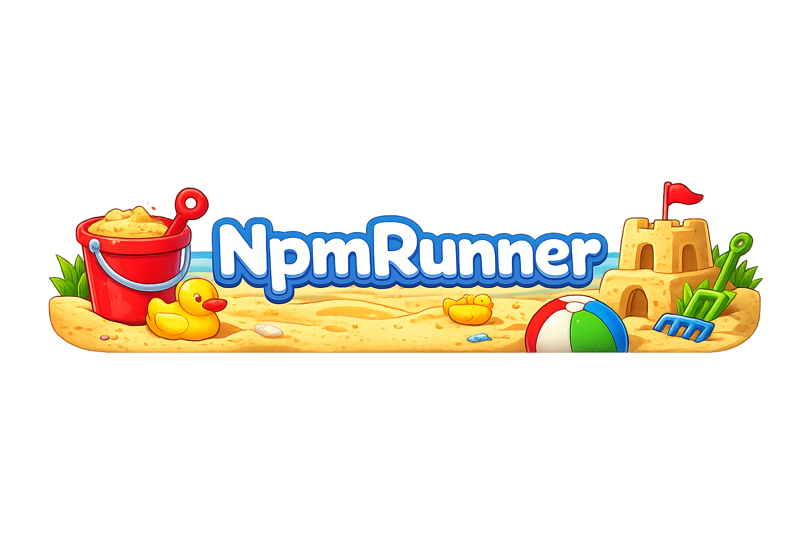

# 📦 NpmRunner

<div align="center">
  
</div>

- 📦 **NpmRunner** is a browser-based JavaScript sandbox that lets you **explore and run npm packages directly in the browser**.
- **NOT** affiliated with `npm, Inc`.
- **NOT** a `RunKit` replacement but you can run stuff here

---

## 🏖️ What You Can Do / Features 🧸

- 🏄 Load any npm package by URL
- 📖 Automatically fetch and render its README
- 🧸 Auto-import sample code from README into the IDE, if present
- 🖥️ Run JavaScript safely inside a sandboxed iframe
- ⚡ Dynamic ESM loading, **with CommonJS (require) support**
- 💻 Monaco Editor (`VS Code–like experience`)
- 🖨️ See console output and errors in real time
- 🧹 Clear editor & clear console buttons
- 🌗 Toggle between Dark / Light themes
- 🔗 Shareable URLs per package
- 🏖️ Test packages without installing anything locally

---

## 📝 TODO 🪁

- TypeScript support
- Add more stuff.

## ⚠️ Limitations

- Native Node APIs (`fs`, `path`, `process`) are unavailable
- Some packages expect a Node runtime
- Not all `README` include runnable browser examples

---

## 🚀 Live Usage 🏖️

Visit:

- [https://npmrunner.vercel.app/sandbox/orc-me](https://npmrunner.vercel.app/sandbox/orc-me)
- [https://npmrunner.vercel.app/sandbox/contains-emoji](https://npmrunner.vercel.app/sandbox/contains-emoji)
- [https://npmrunner.vercel.app/sandbox/is-valid-domain-extension](https://npmrunner.vercel.app/sandbox/is-valid-domain-extension)

Just replace the package name in the URL.

---


## 🧑‍💻 Run Locally 🏖️

### 1. Clone the repo

```bash
git clone https://github.com/tutyamxx/NpmRunner.git
cd NpmRunner/
```

### 2. Install dependencies

```bash
npm install
```

### 3. Start the dev server

```bash
npm run dev
```

Then open:

http://localhost:5173/

---

## 💡 Disclaimer

This project is for educational and experimental purposes only.
It is **not affiliated with npm, Inc.**

<p align="center">
  <a href="https://github.com/tuty4amxx/npmrunner">
    
  </a>
</p>
