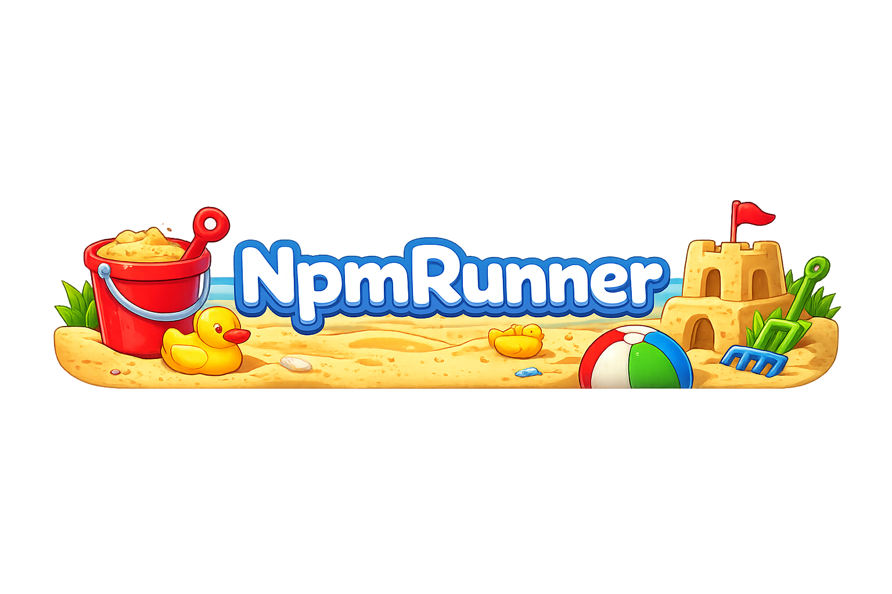

# 📦 NpmRunner
<div align="center">
  <!-- CI/CD workflow badge 🏖️ -->
  <a href="https://github.com/tutyamxx/NpmRunner/actions/workflows/ci.yml">
    
  </a>
  <br />

  <!-- Stylelint, ESLint, and Tests job badges 🏖️ -->
  
  
  
</div>

<div align="center">
  
</div>

- **NpmRunner** is a `browser-based` JavaScript 🏖️ `sandbox` that lets you **explore and run npm packages directly in the browser**.
- **NOT** affiliated with `npm, Inc`.
- **NOT** a `RunKit` replacement but you can run stuff here

## 🏖️ What You Can Do / Features

- 🏖️ Load any npm package by `URL`
- 🏖️ Automatically fetch and render its `README` with `HTML` support
- 🏖️ Auto-import sample code from `README` into the `IDE`, if present
- 🏖️ Run JavaScript safely inside a sandboxed iframe
- 🏖️ Dynamic `ESM` loading, with `CommonJS (require)` support
- 🏖️ Monaco Editor (`VS Code–like experience`)
- 🏖️ See console output and errors in real time
- 🏖️ Clear editor & clear console buttons
- 🏖️ Toggle between `Dark` / `Light` themes
- 🏖️ Shareable URLs per package
- 🏖️ Test packages without installing anything locally
- 🏖️ Works with almost all packages (WIP here, trying to make almost all of them load)

## ⚠️ Limitations

- Scoped packages are supported now, but browser-incompatible packages cannot be loaded. NPMRunner runs in a browser sandbox and will fail for Node-only or build-time packages (e.g., `@stdlib/*`, `@types/*`, `@babel/*`, `eslint*`, `webpack*`, and packages that depend on Node core modules like `fs`, `path`, or `crypto` etc.).
- Native Node APIs (`fs`, `path`, `process`) are unavailable
- Some packages expect a Node runtime
- Not all `README` include runnable browser examples

## 🪁 TODO

- TypeScript support (I might or might not, WIP)
- Add more stuff.

## 🚀 Live Usage

Example usage:

- [https://npmrunner.com/sandbox/@slidoapp/qrcode](https://npmrunner.com/sandbox/%40slidoapp%2Fqrcode)
- [https://npmrunner.com/sandbox/anser](https://npmrunner.com/sandbox/anser)
- [https://npmrunner.com/sandbox/orc-me](https://npmrunner.com/sandbox/orc-me)
- [https://npmrunner.com/sandbox/contains-emoji](https://npmrunner.com/sandbox/contains-emoji)
- [https://npmrunner.com/sandbox/is-valid-domain-extension](https://npmrunner.com/sandbox/is-valid-domain-extension)
- [https://npmrunner.com/sandbox/long](https://npmrunner.com/sandbox/long)
- [https://npmrunner.com/sandbox/mathml-tag-names](https://npmrunner.com/sandbox/mathml-tag-names)

Just replace the `package name` in the URL.

```bash
https://npmrunner.com/sandbox/<package name>
```

## 🧑‍💻 Run Locally

### 1. Clone the repo

```bash
git clone https://github.com/tutyamxx/NpmRunner.git
cd NpmRunner/
```

### 2. Install dependencies

```bash
npm install
```

### 3. Start the dev server

```bash
npm run dev
```

Then open:

http://localhost:5173/

## 💡 Disclaimer

This project is for educational and experimental purposes only.
It is **not affiliated with npm, Inc.**

<p align="center">
  <a href="https://github.com/tuty4amxx/npmrunner">
    
  </a>
</p>
